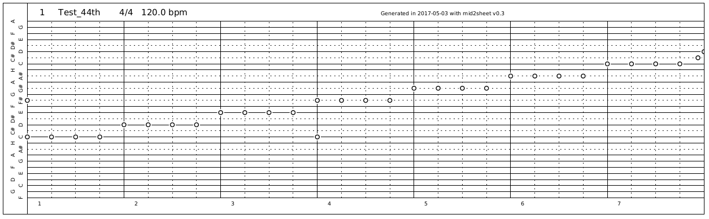
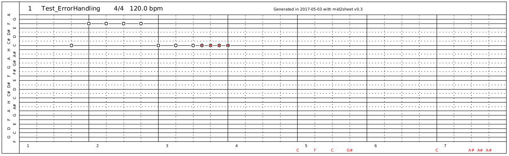

# mid2sheet

### Converts Midi-Files to punch card PDFs for 30 note musicbox

##### Features

* Converts midifile to PDF with multiple pages, landscape
* Matching notes on lines
* Not matching notes are displayed in red on the bottom
* To fast repeating one note will be highlighted
* Bar numbers according to song signature
* Lines for notes with names

##### Limitations

* Midifile with one track only
* Does not support tempo change within song  (e.g. 90 bpm -> 120 bpm)
* Does not support signature change within song (e.g. 3/4 -> 4/4)
* Ignores midi tempo, fixed width per 8th beat

##### Examples

Converted example with 4/4 test notes (no song)

Converted example for error handling, red notes are to close to each other, red letters indicate notes outside the musicbox range.

